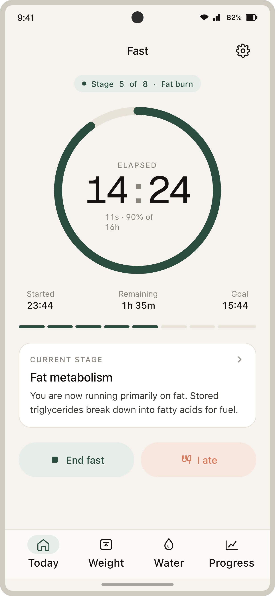
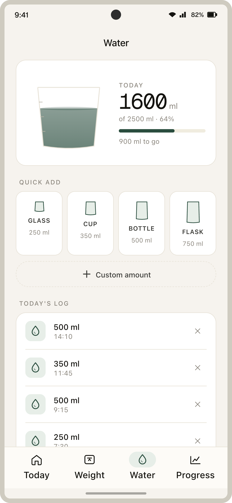

# Interm

A quiet companion for intermittent fasting that tracks your fast windows, body weight, and daily water intake — all on-device, with no ads and no nagging. Built native to Android.

- **Free and open source.** Everything lives in this repo; storage is local-only (Room + DataStore).
- **Track only what matters.** Fasting stage and elapsed time, weight trend, paced hydration goal sized from body weight.
- **Stay on pace.** Live update notification while fasting and gentle reminders at the end of each hydration window only when you fall behind.

| Active fast | Water tracking |
| --- | --- |
|  |  |
